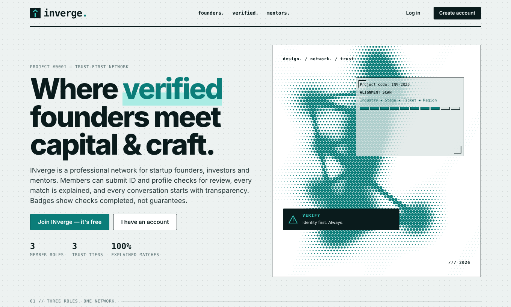
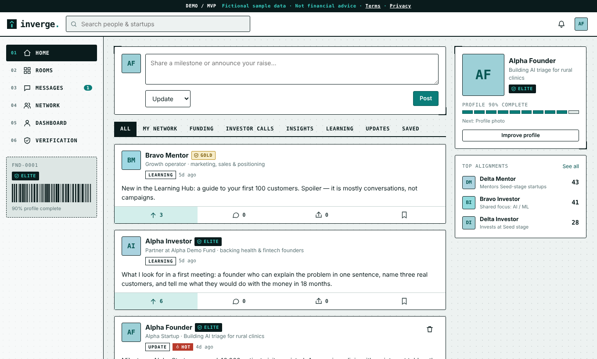
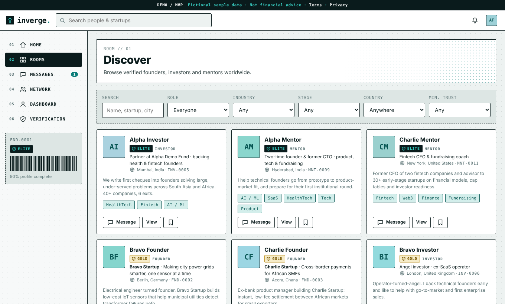
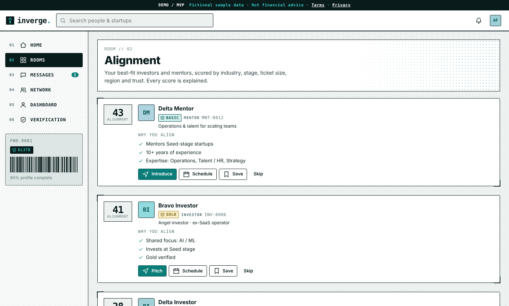
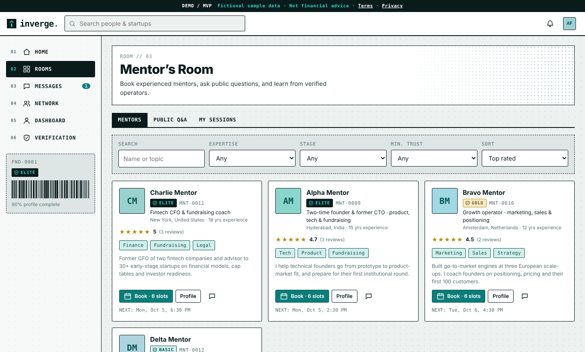

<div align="center">

# INverge

**A trust-first professional network for startup founders, investors and mentors.**

   

**[Live demo → inverge.rishi-ragavs.workers.dev](https://inverge.rishi-ragavs.workers.dev)**



</div>

> **Note:** *INverge* is a **working title** for a personal MVP / concept project. Any similarity to a real business, product or brand is coincidental. All people, companies, funds and figures in the demo are **fictional sample data**. INverge is a networking prototype, **not** a broker, investment adviser or offer of securities.

## The idea

Founders, investors and mentors find each other through noisy, general-purpose networks. INverge explores a narrower, more transparent alternative: every member joins in one fixed role, trust is shown as visible *checks completed* (not blind claims), and every suggested match comes with a plain-English reason.

## Features

| Area | What it does |
|---|---|
| **Role-based signup** | Founder, Investor or Mentor (locked after signup), email one-time-code, password reset, 30-day HttpOnly sessions |
| **Trust badges** | Unverified → **Basic** (email + ID upload + LinkedIn link) → **Gold** (admin reviews documents) → **Elite** (earned through connections and activity). Unverified members are browse-only |
| **Home feed** | Funding, investor-call, insight, learning and update posts; acknowledge, comment, share, save; HOT tag; filters |
| **Rooms** | **Discover** (filters by role, industry, stage, country, trust) · **Alignment** (explained rule-based match scores, pitch, schedule, skip) · **Mentor's Room** (directory, slots, booking, sessions, reviews, public Q&A) · **Learning Hub** (guides, templates, community resources) |
| **Messages** | 1:1 chat with pitch and meeting-request messages, attachments, read receipts |
| **Network & profiles** | Connections, saved profiles, public profile with member-ID barcode, profile-view analytics |
| **Admin review** | `/#/admin` queue to approve or reject verification documents |
| **Design** | Teal poster-inspired system: halftone art, mono labels, corner brackets, barcodes; responsive with a mobile tab bar |

## Screenshots

| Home feed | Discover |
|---|---|
|  |  |
| **Alignment** | **Mentor's Room** |
|  |  |

## Tech stack

- **Backend:** one Cloudflare Worker, plain JavaScript, zero runtime dependencies (`src/`)
- **Database:** Cloudflare D1 (SQLite) (`schema.sql`)
- **Frontend:** static single-page app, vanilla JS modules with hash routing (`public/`)
- **Email:** Resend (optional; without a key the demo shows the one-time code on screen)
- **Runs entirely on Cloudflare's free plan**, no card required

## Run it locally (no Cloudflare account needed)

Requires **Node.js 22.5+**.

```bash
git clone https://github.com/RishiRagavS/INverge.git
cd inverge
npm run seed:build     # creates seed.sql and a random demo password in demo-password.txt
npm run preview        # http://localhost:8788
```

Demo logins (fictional): `alpha.founder@inverge.test`, `alpha.investor@inverge.test`, `alpha.mentor@inverge.test`, `echo.founder@inverge.test` (unverified, browse-only). The shared password is in `demo-password.txt`.

Run the test suite: `npm test` (32 backend checks).

## Deploy to Cloudflare

```bash
npm install
npx wrangler login
npm run db:create          # copy the printed database_id into wrangler.toml
npm run db:init
npm run db:seed            # optional demo data
npm run deploy
```

Optional: `npx wrangler secret put RESEND_API_KEY` for real email codes, and set `ADMIN_EMAILS` in `wrangler.toml` to use the admin page. Resend's free plan only emails your own address until you verify a domain.

## Project structure

```
src/            Worker: index.js, lib.js, routes/{auth,profile,social,mentorship}.js
public/         Frontend: index.html, css/app.css, js/{main,core,nav}.js, js/views/*
schema.sql      Database schema          seed.sql / scripts/make-seed.mjs   Fictional demo data
test/           End-to-end backend tests scripts/preview.mjs               Local preview server
```

## Known limitations (MVP)

- Chat refreshes every 8 seconds (no websockets on the free plan)
- Uploads are stored in D1 with a ~1 MB cap; no R2 object storage
- Password hashing is deliberately light (PBKDF2, 15,000 iterations) to fit the free plan's CPU limit
- Match scoring and investor ticket ranges are sensible defaults, not validated models
- Not yet built: self-service account deletion/export, report/block tools, login rate-limit audit, stored consent timestamps
- Do **not** upload real identity documents to a demo deployment

## Legal

Starter **Terms of Use** and **Privacy Notice** live at `/#/terms` and `/#/privacy`. They are not legal advice and should be reviewed by a lawyer before any public launch. LinkedIn is a trademark of its owner; INverge is not affiliated with or endorsed by LinkedIn.

## Credits

Concept, product design and direction: **Rishi Ragav Shanmuhanathan**. Implementation built with AI assistance (Anthropic's Claude). Fonts: Inter and JetBrains Mono (SIL Open Font License).

## License

Copyright © 2026 RishiRagavS. All rights reserved. Published for viewing and evaluation only; see [LICENSE](LICENSE).
